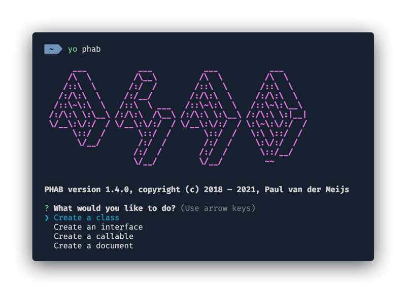

# PHAB

A Yeoman generator for PHP with the ability to resolve namespaces from a Composer file.



## Installation

First make sure you have installed Yeoman. If not, install Yeoman using:

```bash
npm install -g yo
```

Next install the generator using:

```bash
npm install -g generator-phab
```

## Usage

To see a list of all the available generators use the following:

```bash
yo phab
```

Specific generators can also be called directly. E.g.:

```bash
yo phab:class
```

## Generators

Available generators are listed below. These will by default ask the least amount of questions; to access advanced options use the `--advanced` option.

* ### phab:class [<class_name>]

  Creates an empty class.

  The following command will create the class `Models\MyModel` relative to the working directory:

  ```bash
  yo phab:class Models/MyModel
  ```

* ### phab:interface [<interface_name>]

  Creates an empty interface.

  The following command will create the interface `Api\MyInterface` relative to the working directory:

  ```bash
  yo phab:interface Api/MyInterface
  ```

* ### phab:callable [<class_name>]

  Creates a callable class using the `__invoke()` function.

  The following command will create a callable class `Controller\MyController` relative to the working directory:

  ```bash
  yo phab:callable Controller/MyController
  ```

* ### phab:document

  Creates an empty document.

  The following command will create `document.php` relative to the working directory:

  ```bash
  yo phab:document
  ```

## Opening a File

It is possible to open a generated file using the option `-o`. This requires the environment variable `EDITOR` to point to the default editor. E.g.:

```bash
EDITOR=$(which code) yo phab:document -o
```

## Composer Support

If a Composer file is found in any of the parent directories generators will use the autoload configuration from this file to resolve the namespace for the location where the command is called and prepend that to a class or interface.

Default values for author and license will also be read from the Composer file.
